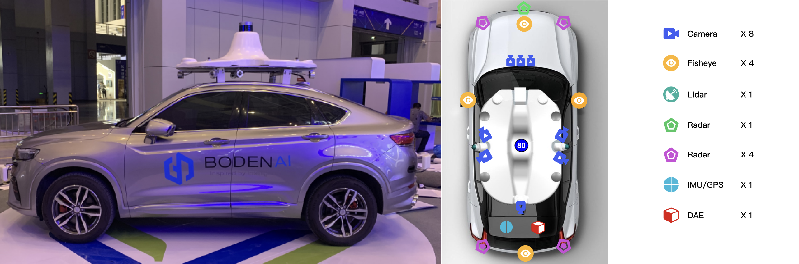

# Boden Around View Monitor Dataset

## Introduction

Boden Around View Monitor Dataset is a newly large-scale dataset for study and application purpose. It contains 20k images with mannully labeled annotations. 

The images in this dataset were Arround-view images synthesized from four fisheye cameras. Detailed description of images:
* Resolution: 1024*1024
* View Range: 15m*15m

**Sensor setup**:
* Fisheye Cameras: SG2-IMX390C-GMSL2-H190s
  * HFOV: 216
  * VFOV: 124
  * Resolution: 1920*1080
* Fully equipped vehicle is shown in figure:
  

**Scenes**: The dataset was recorded in various indoor and outdoor parking sites. When collecting outdoor data, different illumination conditions and weather conditions were considered. 

**Annotations**: The dataset has annotations for
* Parking Slot (released)
* Freespace (planning)
* Semantic Segmentation (planning)

**Planning**:
* Release 2k images and annotations

## How to Download

* Dwonload links
  * Baidu Cloud
  * Google Cloud

## Terms of Use
The images and annotations of this dataset are licensed under a [Creative Commons Attribution 4.0 License](LICENSE).

## About Us
BodenAI is an industry-leading provider for closed-loop toolchains in autonomous driving data.If you have any suggestion about the dataset, find any mistakes in annotations, or commercial cooperation, please contact us.
* Email address: company@bodenai.com

