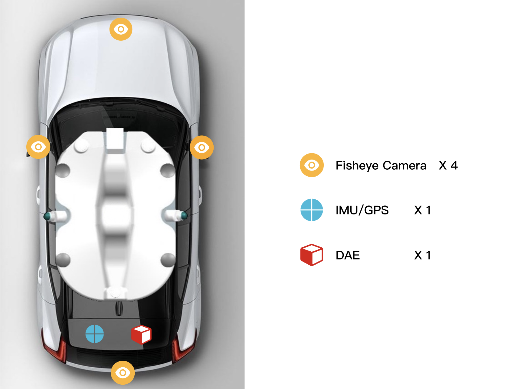

  

## Introduction

**Boden Around View Monitor Dataset** is a large-scale open source dataset for academic and industrial purpose, which consists of 20k desensitized images with mannully labeled annotations. 

The images in this dataset are Around-view images synthesized from four fisheye cameras. Detailed description of images:
* Resolution: 1024 x 1024 pixels
* View Range: 15m x 15m
* Sample video of stitching images from 4 fish-eye cameras

  

**Sensor setup**:
* Fisheye Cameras: SG2-IMX390C-GMSL2-H190s
  * HFOV: 216°
  * VFOV: 124°
  * Resolution: 1920 x 1080 pixels
  
  

  
  

**Scenes**: The dataset was recorded in various indoor and outdoor parking sites. When collecting outdoor data, different illumination conditions and weather conditions were considered. 
* Underground Parking lot
* Indoor Parking Building
* Surface Parking lot
* Roadside Parking lot

**Annotations**: The dataset has annotations for
* Parking Slot (released)
* Freespace (planning)
* Semantic Segmentation (planning)
* Detailed description of annotation specification can be seen [here](docs/annotation.md).

**Planning**
- [x] release images and annotations
- [ ] release visualization script

## How to Download

* Download links for 2k sample images and annotations
  * Baidu Cloud
  * Google Cloud
* 18K images and annotations:
  * will be released soon （1st/Sep/2022）
  * Application Only. Please send an application to our Email address. The template of application can be seen here

## Terms of Use
The images and annotations of this dataset are licensed under a [Creative Commons Attribution 4.0 License](LICENSE).

## About Us
BodenAI is an industry-leading provider for closed-loop toolchains in autonomous driving data. 
For mistakes in annotations submmision, professional support requests, or commercial cooperation, please contact us. Email address: company@bodenai.com

