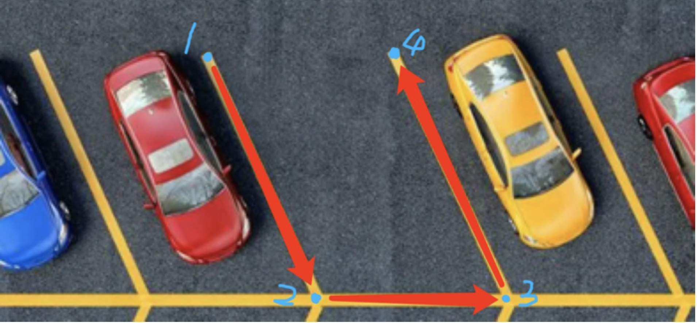
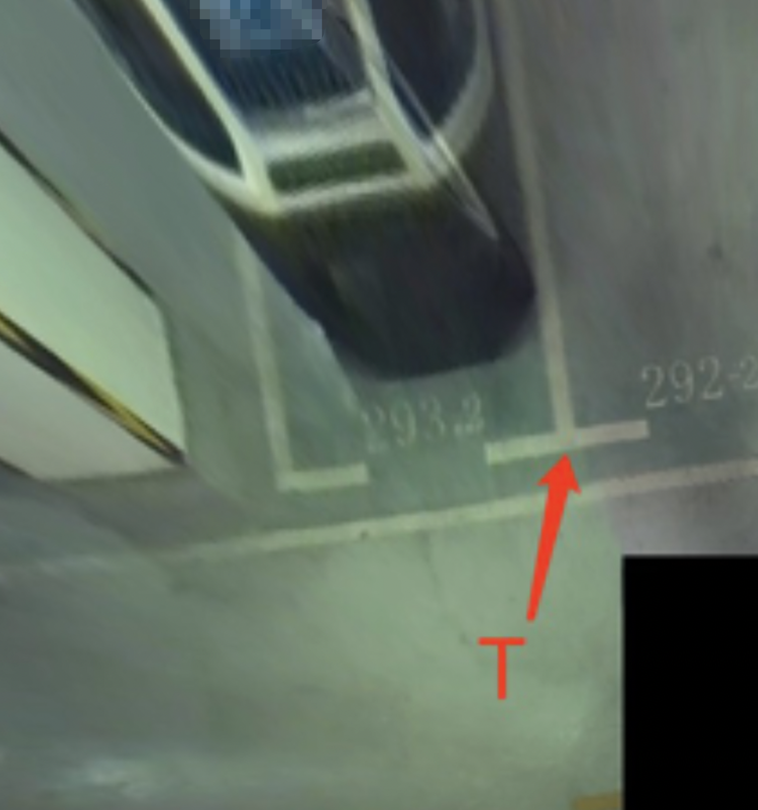
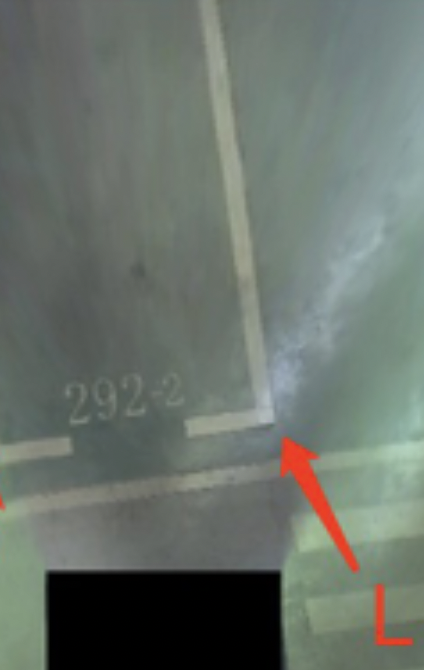
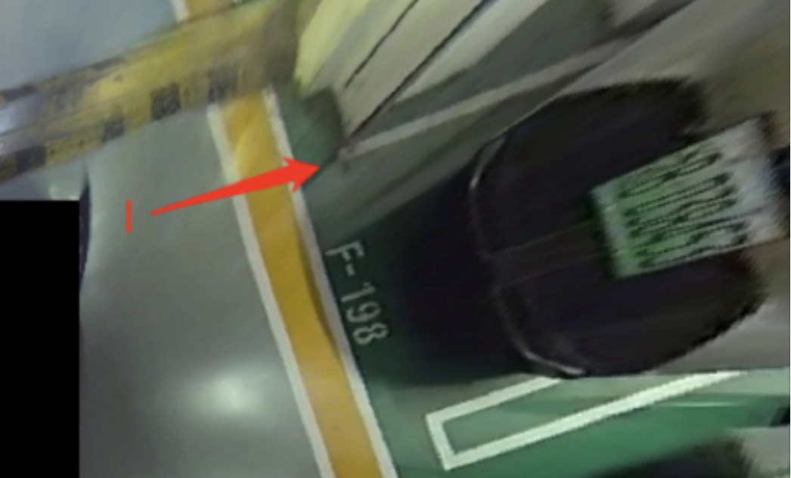
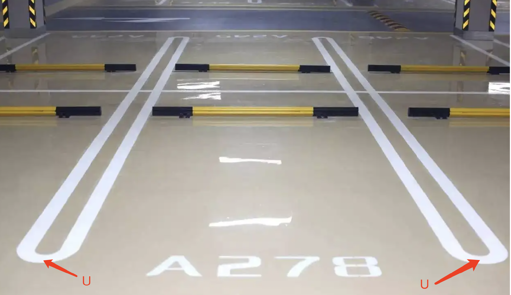

  

# Annotation Guideline

## Parking Slot
* **Corner Points**: The four corner points of the parking slot are defined in the counterclockwise direction, and the starting point (named 1) and the end point (named 4) are in the entry line. The points named 2 and 4 are used to determine the angle of the parking slot. Examples are shown in figure:

  
  
  

* **Slot Status**: Whether the parking slot is occupied by something or empty
  * occupied
  * empty
* **Slot Type**: The shape of the parking slot
  * vertical
  * horizontal
  * slant
* **Slot Line Completeness**: Whether the line of the whole parking slot is comlete or in complete in the image. 
  * complete
  * incomplete
* **Corner Type**: The shape of the corner points. Only annotated for the points that form the entrance line
  * T

  

  
  

  
  * L

  

  
  

  
  * I
  
  
  

  
  

  
  * U

  

  
  

  
  * Other
